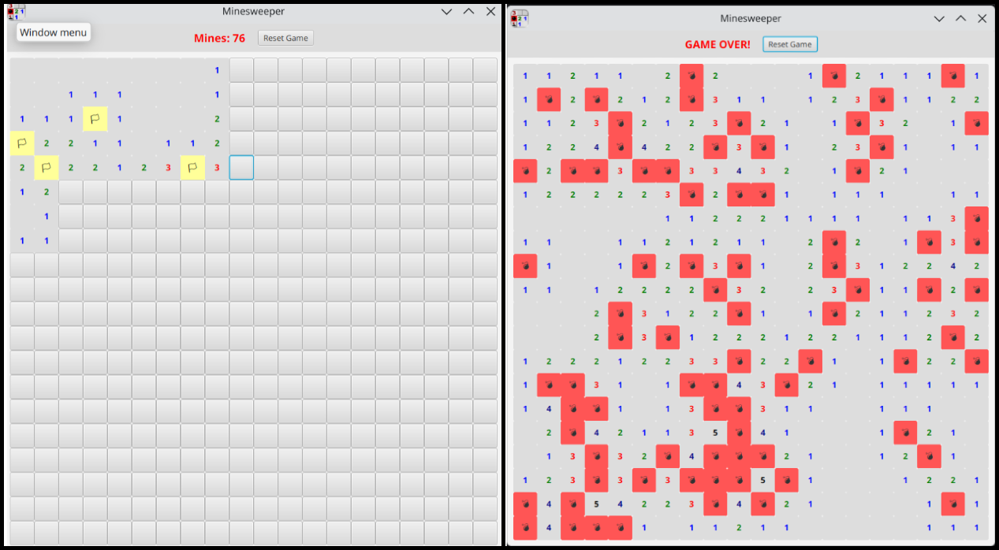

<p align="center">
  
  
  
</p>

#  JavaFX Minesweeper

A modern, graphical implementation of the classic **Minesweeper** game built using **Java**, **JavaFX**, and **Maven**.

##  Preview


---

##  Features

- **Classic Gameplay:** Left-click to reveal cells, right-click to place/remove flags ⚐.
- **Auto-Reveal (Flood Fill):** Safely opens large empty areas when you click on a cell with 0 adjacent mines.
- **Dynamic Board:** 10x10 Grid with 20 randomly placed mines.You can change it in MinesweeperController.java.
- **Color-Coded Clues:** Numbers are color-coded (1=Blue, 2=Green, 3=Red, etc.) for easy readability.
- **Win/Loss Detection:** Tracks flags placed and immediately shows if you won or hit a mine (☢︎).
- **Reset Functionality:** Easy "Reset Game" button to start a fresh board instantly.

---

##  Program Structure

### The Board
The most basic and important element of the game is the Board. The board is implemented in the form of a 2D Array. Board has cells in its rows and columns. These cells contain mines or the number of adjacent mines. The board class implements the core game logic using the following functions:

- **`placeMines()`**: Places mines at random indexes in Board.
- **`countMinesAround()`**: For every cell, calculates mines in its adjacent cells.
- **`isValid()`**: Checks if the current index being processed is not out of bounds.
- **`openZeroCells()`**: If a clicked cell does not have a mine nor any number, it opens all zero cells in its neighbor recursively, until it hits upon any cell which has a number.
- **`revealCell()`**: Reveals the mines, number of mines in adjacent cells, or just an empty cell.
- **`checkWin()`**: Checks if a player has won the game by comparing revealed cells. If `total cells - revealed cells = total mines`, it means only mines are unrevealed, and the player wins.

### The Cell
The `Cell` object represents individual grid items and maintains the following states and properties:
- Is it a **mine**?
- Is it **flagged**?
- Is it **revealed**?
- It stores the **number of mines** in adjacent cells.

It handles its state through dedicated functions:
- **`toggleFlag()`**: If the cell is not flagged, changes it to flagged (and vice versa).

### The GUI
The GUI of the game is handled in the `MinesweeperController` class. It has the following structure:
- The basic component of the GUI is a **GridPane**, a 2D layout pane, which contains all cells.
- All cells visually are **buttons**.
- All buttons share the same event handler, which reveals the cells based on the following rules:
  - If it's a mine, the game is over.
  - If it has mines in its adjacent cells, it shows the number.
  - If it has zero mines in its adjacent cells, then it opens all the zero cells in its neighbor, until it hits a cell with a number.
  - If the user right-clicks the mouse, it flags the cell. This allows players to keep a record of potential mines.

---


##  How to Run

### Requirements
- **Java JDK 21+** (or compatible version specified in `pom.xml`)
- **Maven** (Installed, or use the included `mvnw` wrapper)

### Running Locally

1. **Clone the repository:**
   ```bash
   git clone https://github.com/MukaramNadeem/minesweeper-java.git
   cd minesweeper-javafx
   ```

2. **Clean and compile using Maven:**
   ```bash
   mvn clean compile
   ```

3. **Run the application:**
   ```bash
   mvn javafx:run
   ```

*(Alternatively, if your IDE supports it, simply import the `pom.xml` as a Maven project and run `MinesweeperApp.java`!)*

---

##  Contributing
Feel free to fork the repository, make improvements (such as adding difficulty levels or a custom timer), and submit a pull request!
